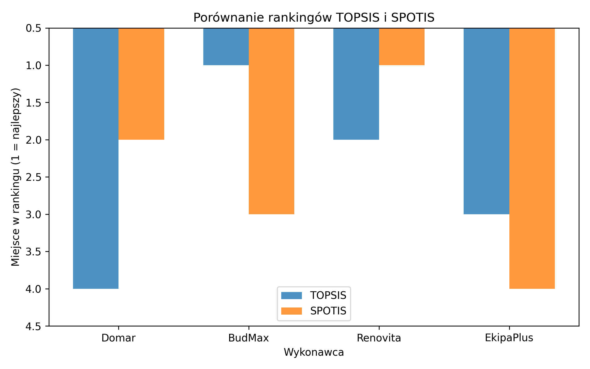

# zadanie_4_pymcd

# Laboratorium 4 – Analiza decyzyjna z wykorzystaniem biblioteki `pymcdm`

## 1. Cel zadania

Celem zadania było zapoznanie się z biblioteką `pymcdm` oraz zastosowanie metod wielokryterialnego podejmowania decyzji (MCDM), takich jak **TOPSIS** i **SPOTIS**, w celu wyznaczenia rankingu alternatyw.

---

## 2. Opis problemu decyzyjnego

Zadanie polegało na wyborze najlepszego wykonawcy remontu spośród czterech firm:

- Domar  
- BudMax  
- Renovita  
- EkipaPlus  

Rozpatrywane były następujące kryteria:

| Kryterium                | Typ             | Waga |
|--------------------------|------------------|------|
| Cena (zł)                | Minimalizacja    | 0.4  |
| Czas realizacji (dni)    | Minimalizacja    | 0.2  |
| Ocena klientów (1–10)    | Maksymalizacja   | 0.3  |
| Gwarancja (lata)         | Maksymalizacja   | 0.1  |

---

## 3. Zastosowane metody

W analizie wykorzystano dwie metody decyzyjne:

- **TOPSIS** – metoda bazująca na odległości od rozwiązania idealnego i anty-idealnego.
- **SPOTIS** – metoda oparta na minimalizacji odległości do rozwiązania wzorcowego, z uwzględnieniem kierunku kryteriów.

Dane zostały znormalizowane metodą min-max, a dla SPOTIS wyznaczono przedziały (`bounds`) automatycznie na podstawie danych wejściowych.

---

## 4. Wyniki analizy

Poniżej przedstawiono wyniki rankingów dla każdej z metod:

| Firma      | TOPSIS Wynik  | TOPSIS Ranking | SPOTIS Wynik   | SPOTIS Ranking  |
|------------|---------------|----------------|----------------|-----------------|
| Domar      | 0.4812        | 4              | 0.430          | 2               |
| BudMax     | 0.5392        | 1              | 0.585          | 3               |
| Renovita   | 0.5167        | 2              | 0.400          | 1               |
| EkipaPlus  | 0.4833        | 3              | 0.600          | 4               |

---

## 5. Porównanie metod – wykres

W celu lepszego zobrazowania wyników porównano rankingi TOPSIS i SPOTIS na wykresie słupkowym:

---

## 6. Wnioski

- **BudMax** został uznany za najlepszą firmę według metody **TOPSIS**.
- **Renovita** zajęła 1. miejsce w rankingu **SPOTIS**, mimo wyższej ceny, co może być spowodowane lepszą
